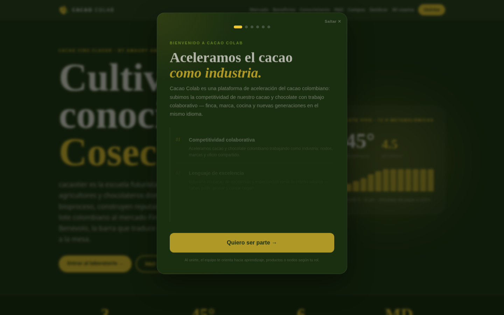
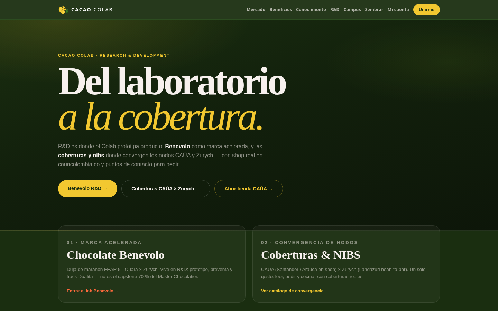
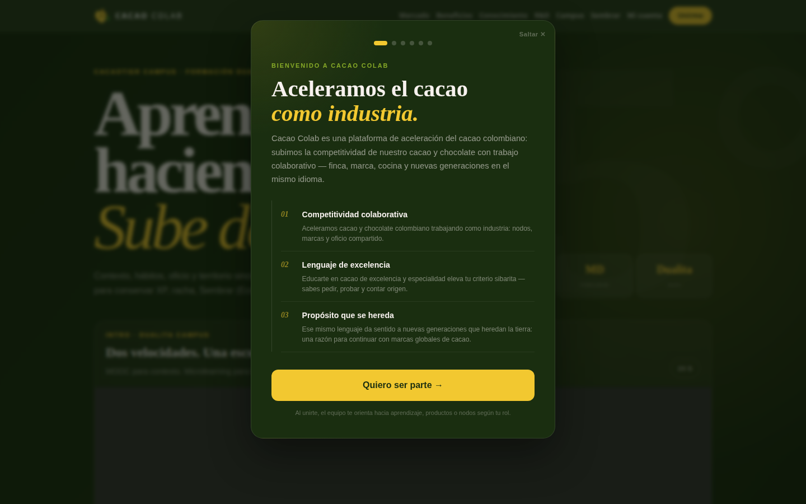
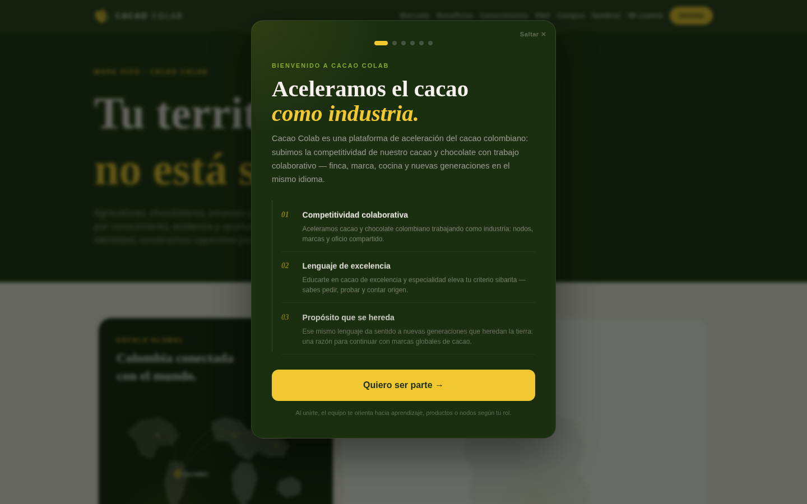
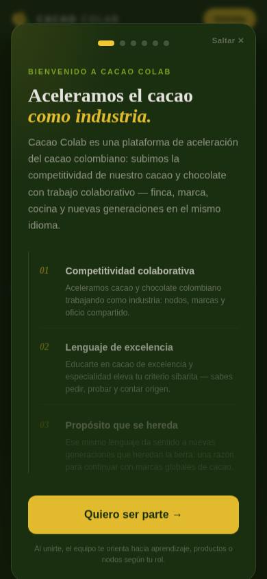
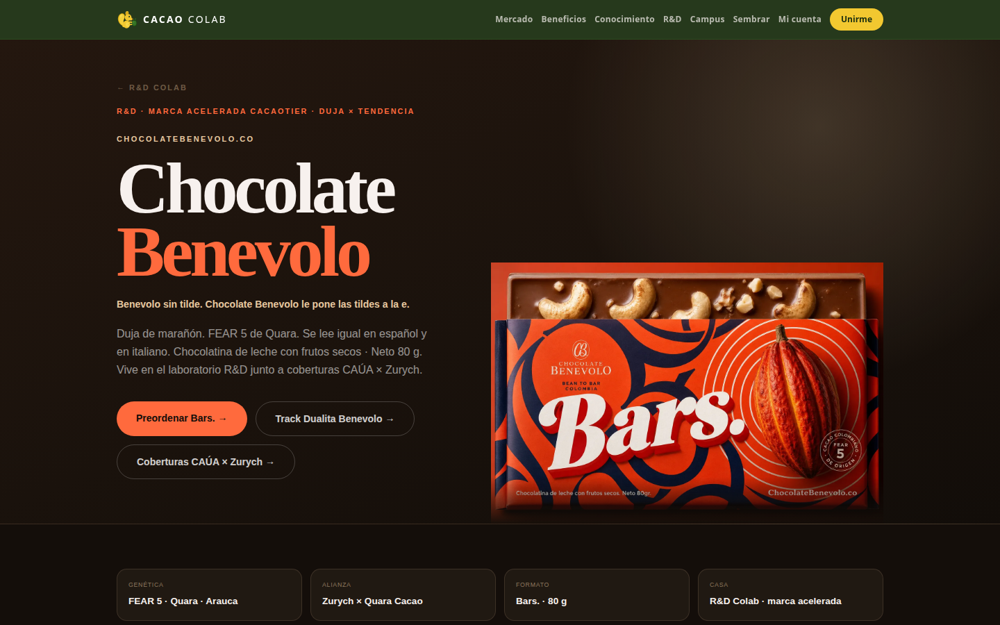

# Cacao Colab

**Aceleramos el cacao como industria.**

Marketplace + Dualita + Sembrar + R&D (Benevolo · coberturas CAÚA × Zurych) para el cacao Fine-Flavor colombiano.

**Live:** [cacao-colab.vercel.app](https://cacao-colab.vercel.app)  
**Repo:** [amauryamed-svg/cacao-colab](https://github.com/amauryamed-svg/cacao-colab)

---

## Builders fundadores

Somos tres. Este repositorio es nuestro taller compartido.

| Builder | GitHub | Rol |
|---------|--------|-----|
| **Amaury Amed** | [`amauryamed-svg`](https://github.com/amauryamed-svg) | Product Manager · Founder cacaotier |
| **Hellen Bareño** | [`HellenBareno-eng`](https://github.com/HellenBareno-eng) | Frontend Lead |
| **Oscar Gamboa** | [`oscargamboa68`](https://github.com/oscargamboa68) | Backend Lead |

Guía de roles → [`docs/19-BUILDERS-FOUNDERS.md`](docs/19-BUILDERS-FOUNDERS.md)

---

## Pantallazos

<p>
  
  
</p>
<p>
  
  
</p>
<p>
  
  
</p>

Más capturas en [`docs/assets/screenshots/`](docs/assets/screenshots/).

---

## Stack y lenguaje

Todo el monorepo habla **TypeScript**.

| Superficie | Stack |
|------------|--------|
| `apps/web` | Next.js 16 · React 19 · Tailwind v4 · Supabase Auth · HubSpot |
| `apps/api` | Next.js 16 headless · Zod · Stripe stub · webhooks |
| `apps/mobile` | Expo 57 · expo-router · React Native |
| `packages/*` | types, ui-tokens, supabase-client, hubspot-client, ai-companion |
| Datos | Supabase (Postgres + RLS) |

Detalle → [`docs/06-ARQUITECTURA.md`](docs/06-ARQUITECTURA.md) · [`docs/02-PLATFORM.md`](docs/02-PLATFORM.md)

---

## Plug and play — descarga el Colab

```bash
git clone https://github.com/amauryamed-svg/cacao-colab.git
cd cacao-colab
./scripts/bootstrap.sh

pnpm dev:web     # Hellen → http://localhost:3000
pnpm dev:api     # Oscar
pnpm --filter @cacao-colab/mobile start   # Expo Go
```

Guía completa → [`docs/20-PLUG-AND-PLAY.md`](docs/20-PLUG-AND-PLAY.md)

---

## App Store y Google Play

Empezamos a documentar el camino de publicación y descarga en tiendas:

→ [`docs/21-APP-STORES.md`](docs/21-APP-STORES.md)

Hoy: **Expo Go** (QR). Mañana: fichas App Store / Google Play cuando Amaury active las cuentas de desarrollador.

---

## Invítate al Colab

1. Entra a [cacao-colab.vercel.app](https://cacao-colab.vercel.app) y pulsa **Unirme**  
2. Si eres marca o nodo → WhatsApp del site  
3. Si eres builder → clona este repo, corre el bootstrap y abre un PR  

El círculo de nodos permanece abierto. Las marcas regionales conservan su identidad.

---

## Documentación Spec-Driven

| Doc | Contenido |
|-----|-----------|
| [`00-SPEC.md`](docs/00-SPEC.md) | Fuente de verdad |
| [`19-BUILDERS-FOUNDERS.md`](docs/19-BUILDERS-FOUNDERS.md) | Roles del trío fundador |
| [`20-PLUG-AND-PLAY.md`](docs/20-PLUG-AND-PLAY.md) | Bootstrap |
| [`21-APP-STORES.md`](docs/21-APP-STORES.md) | App Store / Google Play |
| [`06-ARQUITECTURA.md`](docs/06-ARQUITECTURA.md) | Monorepo técnico |
| [`13-MOBILE.md`](docs/13-MOBILE.md) | App Expo |

---

## Licencia / contribución

Proyecto privado del ecosistema Cacao Colab.  
Contribuidores nombrados: ver [`CONTRIBUTORS.md`](CONTRIBUTORS.md) y [`CONTRIBUTING.md`](CONTRIBUTING.md).
